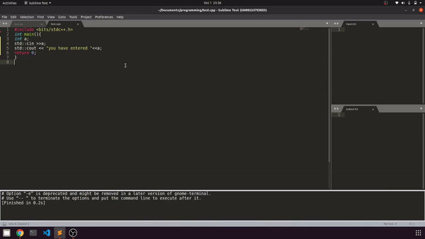

___
# sublime_text 
*for linux*

This is my sublime text snippets and build system.

just install sublime text 3 and replace the folder packages in installed packages with this .

Happy Coding .
___
## How to use it 
*clone this repo*

1.If you had a fresh Installation of sublime-text-3 open file manager then go to `\home\.config\sublime-text-3\`

then replace the packages folder with the packages folder from this repo.

2. If you are a exsisting user of sublime-text-3 then copy all the builds from the folder [builds](builds) and paste them inside `\home\.config\sublime-text-3\Packages\User`

**To see the .config folder allow file manager to show hidden files**.if stuck in this check out [this](https://itsfoss.com/hide-folders-and-show-hidden-files-in-ubuntu-beginner-trick/)

3.***Very Very Important*** Before using the cp builds make sure you update the input.txt and output.txt files by default they are in the root space but make sure you update them and open then while coding.
as an example the python3-cp build is 
```
{
	"cmd": ["bash","-c","timeout 5s python3 '$file' <input.txt >output.txt" ]
}
```
but for my case as I stored the output.txt and input.txt in my a folder named programming under Documents in my case the build will be.
```
{
	"cmd": ["bash","-c","timeout 5s python3 '$file' <\home\debo\Documents\programming\input.txt >\home\debo\Documents\programming\output.txt" ]
}
```
___
## Explanation of builds
*why two builds for one language??*
For python and c++ each there are two buildes one div and one cp. The cp one is for competitive programming it will accept inputs from a input.txt file and will output in a output.txt file.The dev one does everything on terminal it is usuefull while development ;~}.
___
## Looks 
***CPP-DEV***


